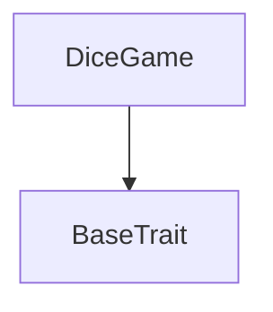
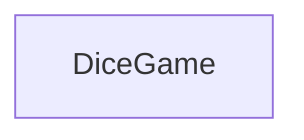

# Tact compilation report
Contract: DiceGame
BoC Size: 487 bytes

## Structures (Structs and Messages)
Total structures: 14

### DataSize
TL-B: `_ cells:int257 bits:int257 refs:int257 = DataSize`
Signature: `DataSize{cells:int257,bits:int257,refs:int257}`

### SignedBundle
TL-B: `_ signature:fixed_bytes64 signedData:remainder<slice> = SignedBundle`
Signature: `SignedBundle{signature:fixed_bytes64,signedData:remainder<slice>}`

### StateInit
TL-B: `_ code:^cell data:^cell = StateInit`
Signature: `StateInit{code:^cell,data:^cell}`

### Context
TL-B: `_ bounceable:bool sender:address value:int257 raw:^slice = Context`
Signature: `Context{bounceable:bool,sender:address,value:int257,raw:^slice}`

### SendParameters
TL-B: `_ mode:int257 body:Maybe ^cell code:Maybe ^cell data:Maybe ^cell value:int257 to:address bounce:bool = SendParameters`
Signature: `SendParameters{mode:int257,body:Maybe ^cell,code:Maybe ^cell,data:Maybe ^cell,value:int257,to:address,bounce:bool}`

### MessageParameters
TL-B: `_ mode:int257 body:Maybe ^cell value:int257 to:address bounce:bool = MessageParameters`
Signature: `MessageParameters{mode:int257,body:Maybe ^cell,value:int257,to:address,bounce:bool}`

### DeployParameters
TL-B: `_ mode:int257 body:Maybe ^cell value:int257 bounce:bool init:StateInit{code:^cell,data:^cell} = DeployParameters`
Signature: `DeployParameters{mode:int257,body:Maybe ^cell,value:int257,bounce:bool,init:StateInit{code:^cell,data:^cell}}`

### StdAddress
TL-B: `_ workchain:int8 address:uint256 = StdAddress`
Signature: `StdAddress{workchain:int8,address:uint256}`

### VarAddress
TL-B: `_ workchain:int32 address:^slice = VarAddress`
Signature: `VarAddress{workchain:int32,address:^slice}`

### BasechainAddress
TL-B: `_ hash:Maybe int257 = BasechainAddress`
Signature: `BasechainAddress{hash:Maybe int257}`

### BetDice
TL-B: `bet_dice#00000021 nonce:uint64 guess:uint8 clientSeed:^cell commitment:^cell serverSeedHash:^cell = BetDice`
Signature: `BetDice{nonce:uint64,guess:uint8,clientSeed:^cell,commitment:^cell,serverSeedHash:^cell}`

### RevealDice
TL-B: `reveal_dice#00000022 nonce:uint64 serverSeed:^cell guess:uint8 = RevealDice`
Signature: `RevealDice{nonce:uint64,serverSeed:^cell,guess:uint8}`

### DiceResult
TL-B: `dice_result#00000024 diceRoll:uint8 serverSeed:^cell nonce:uint64 = DiceResult`
Signature: `DiceResult{diceRoll:uint8,serverSeed:^cell,nonce:uint64}`

### DiceGame$Data
TL-B: `_ minBet:coins maxBet:coins houseEdgeBps:uint16 state:uint8 totalBets:coins totalPayouts:coins pendingNonce:uint64 pendingBet:coins pendingGuess:uint8 = DiceGame`
Signature: `DiceGame{minBet:coins,maxBet:coins,houseEdgeBps:uint16,state:uint8,totalBets:coins,totalPayouts:coins,pendingNonce:uint64,pendingBet:coins,pendingGuess:uint8}`

## Get methods
Total get methods: 0

## Exit codes
* 2: Stack underflow
* 3: Stack overflow
* 4: Integer overflow
* 5: Integer out of expected range
* 6: Invalid opcode
* 7: Type check error
* 8: Cell overflow
* 9: Cell underflow
* 10: Dictionary error
* 11: 'Unknown' error
* 12: Fatal error
* 13: Out of gas error
* 14: Virtualization error
* 32: Action list is invalid
* 33: Action list is too long
* 34: Action is invalid or not supported
* 35: Invalid source address in outbound message
* 36: Invalid destination address in outbound message
* 37: Not enough Toncoin
* 38: Not enough extra currencies
* 39: Outbound message does not fit into a cell after rewriting
* 40: Cannot process a message
* 41: Library reference is null
* 42: Library change action error
* 43: Exceeded maximum number of cells in the library or the maximum depth of the Merkle tree
* 50: Account state size exceeded limits
* 128: Null reference exception
* 129: Invalid serialization prefix
* 130: Invalid incoming message
* 131: Constraints error
* 132: Access denied
* 133: Contract stopped
* 134: Invalid argument
* 135: Code of a contract was not found
* 136: Invalid standard address
* 138: Not a basechain address
* 20685: Min bet
* 27815: No pending bet
* 34905: 1-6 only
* 44244: Nonce mismatch
* 46897: Max bet
* 47276: Reveal previous bet first
* 59457: Paused

## Trait inheritance diagram

## Contract dependency diagram

